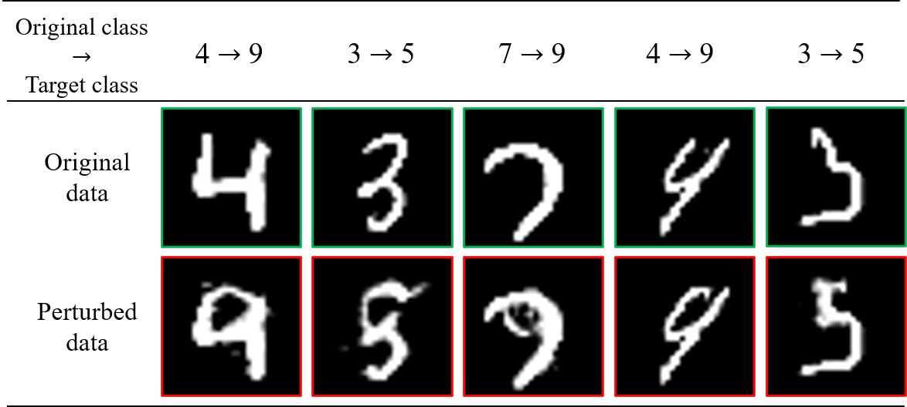
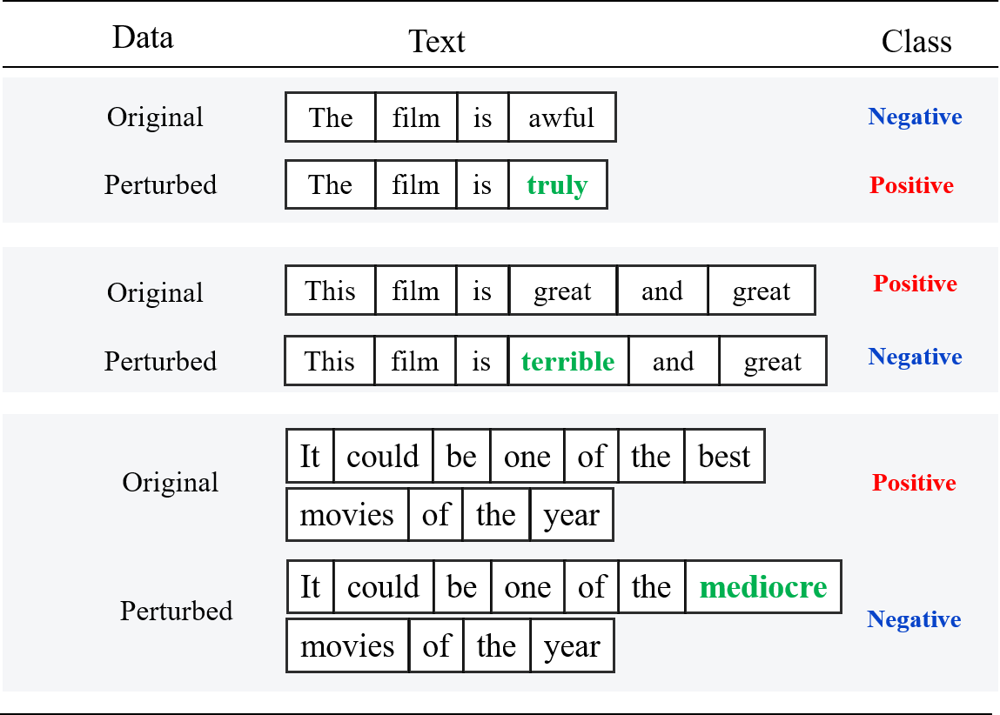
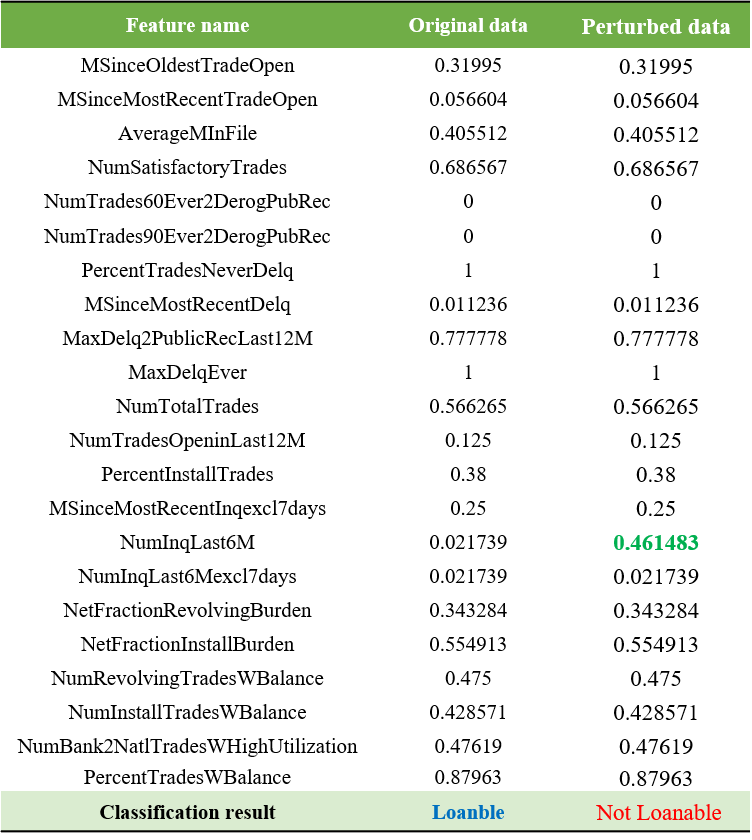

# Counterfactual Explanation Based on Gradual Construction for Deep Networks


:star: Star us on GitHub — it helps!!


PyTorch implementation for *[Counterfactual Explanation Based on Gradual Construction for Deep Networks](https://arxiv.org/abs/2008.01897)*

## Install

You will need a machine with a GPU and CUDA installed.  
Then, you prepare runtime environment:

   ```shell
   pip install -r requirements.txt
   ```

If you get an error message `ModuleNotFoundError: No module named 'urllib3'` on conda enviroment, please try to install spacy like this:
```shell
conda install spacy==2.3.2
```

## Use

### MNIST dataset

Run the collowing command to get a counterfactual explanation for MNIST data.

```shell
python main.py --dataset=mnist --model_path=./models/saved/mnist_cnn.pt --data_path=example/MNIST/0.png --d=4 --target_prob=0.9
```

Results are saved in **result** folder.





### IMDB dataset

For IMDB dataset, you should download 'en' model. Type following command.

```shell
python -m spacy download en
```

Run the collowing command to get a counterfactual explanation for IMDB data.


```shell
python main.py --dataset=imdb --model_path=./models/saved/tut4-model.pt --data_path="This film is good" --d=1 --target_prob=0.9 --n_iter=700
```


### HELOC dataset

Run the collowing command to get a counterfactual explanation for HELOC data.

```shell
python main.py --dataset=heloc --model_path=./models/saved/MLP_pytorch_HELOC_allRemoved.pt --data_path=./example/HELOC/1.csv --d=1 --target_prob=0.7
```

The target probability over 0.7 is not allowed because of the pre-trained model capacity. 




Arguments:

- `dataset` - Choose the experiment dataset 
	- Available list: ['mnist','imdb','heloc'] 
- `data_path` - Input data (path)
- `l2_coeff` - Coefficient of the l2 regularization
- `tv_beta` - Exponential number of total variation (TV) regularization
- `tv_coeff` - Coefficient of the TV regularization
- `n_iter` - Iteration number
- `lr` - Learning rate
- `target_class` - Choose the target class 
	- 0: a class that has the first highest proability from an original data
	- 1: a class that has the second highest proability from an original data
	- 2: a class that has the third highest proability from an original data
- `target_prob` - Target probability of the target class
- `d` - Determine size of mask
- `model_path` - Saved model path 
	- Available list=['mnist_cnn.pt',tut4-model.pt','MLP_pytorch_HELOC_allRemoved.pt'] 


## Understanding my paper

:white_check_mark: Check my blog!!
[HERE](https://da2so.github.io/2020-09-14-Counterfactual_Explanation_Based_on_Gradual_Construction_for_Deep_Networks/)